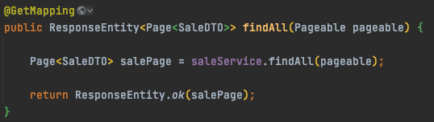
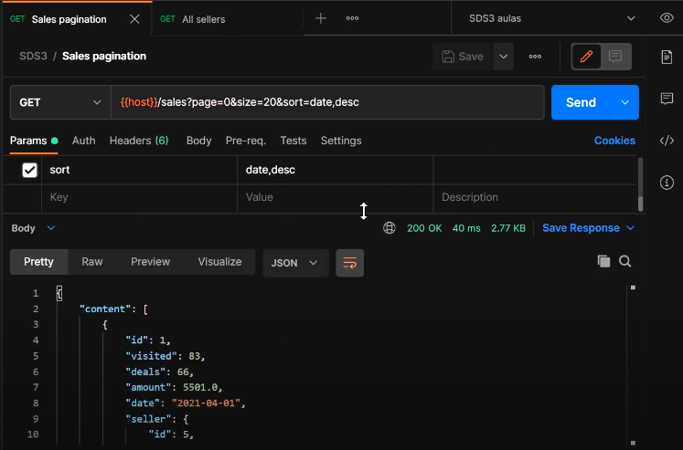
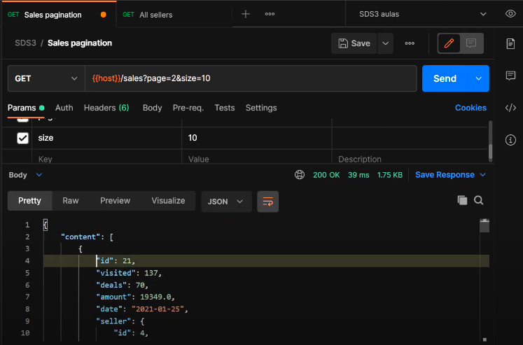
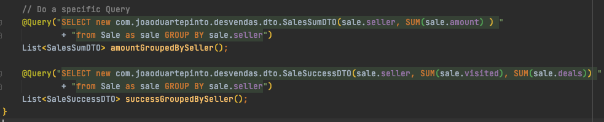
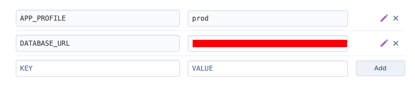
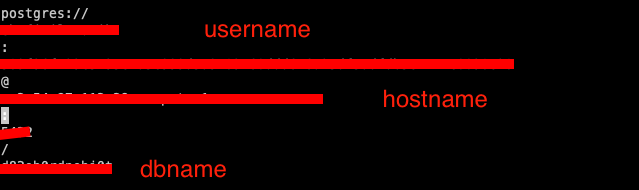
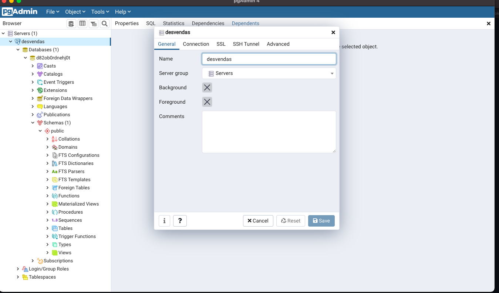
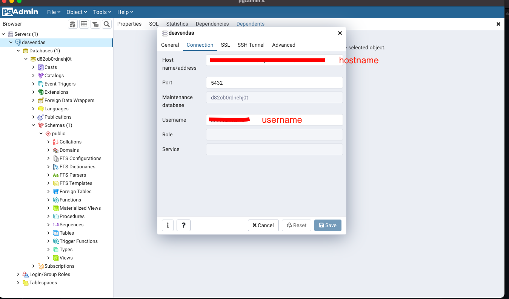
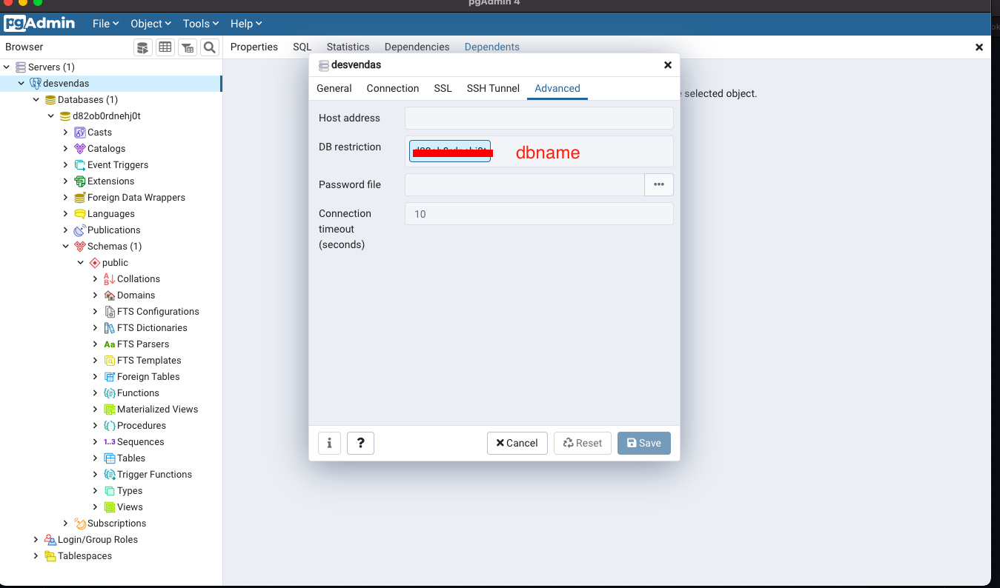

# Project developed at Spring React Week developed by [devsuperior.com.br](https://devsuperior.com.br)

## Snippets/How to

### Pagination

Method in controller accepts a Paginable and returns a Page, all subsequents methos must accept and return the same.







### Query



### SecurityConfig

```
@Configuration
@EnableWebSecurity
public class SecurityConfig extends WebSecurityConfigurerAdapter {

    @Autowired
    private Environment env;

    @Override
    protected void configure(HttpSecurity http) throws Exception {
        if (Arrays.asList(env.getActiveProfiles()).contains("test")) {
            http.headers().frameOptions().disable();
        }

        http.cors().and().csrf().disable();
        http.sessionManagement().sessionCreationPolicy(SessionCreationPolicy.STATELESS);
        http.authorizeRequests().anyRequest().permitAll();
    }

    @Bean
    CorsConfigurationSource corsConfigurationSource() {
        CorsConfiguration configuration = new CorsConfiguration().applyPermitDefaultValues();
        configuration.setAllowedMethods(Arrays.asList("POST", "GET", "PUT", "DELETE", "OPTIONS"));
        final UrlBasedCorsConfigurationSource source = new UrlBasedCorsConfigurationSource();
        source.registerCorsConfiguration("/**", configuration);
        return source;
    }
}
```

### Heroku

- Create Account and an App.

- To application.properties add:

```
spring.profiles.active=${APP_PROFILE:test}

spring.jpa.open-in-view=false
```

 - application-prod.properties

```
spring.datasource.url=${DATABASE_URL}
```

Create a system.properties file at root of project and add:

```
java.runtime.version=11
```

In Heroku, we must add Postgres plugin.

Add system variables:



Connect db to pgAdmin:









Now, create the db layout with create.sql and instroduce fake data with data.sql.

To conect the project to heroku:

```
heroku -v
heroku login
heroku git:remote -a <app-name>
git remote -v
git subtree push --prefix <subtree-folder> heroku master
```